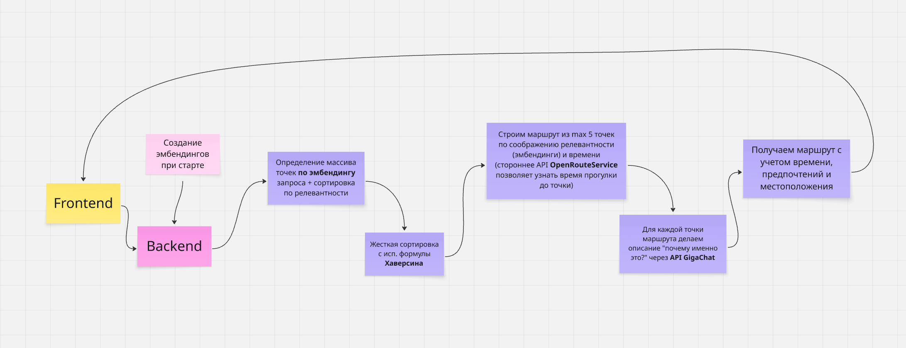

# Помощник туриста от команды May

ML-помощник по поиску маршрута в Нижнем Новгороде, наша программа помогает туристам искать маршруты по их предпочтениям и по наличию у них времени.
Внимание❗ Так как проект MVP поиск маршрута выполняется не быстро, будут вестись работы по оптимизации.



## Конечные точки


## Запуск

### Требования
- [Git](https://git-scm.com/)
- [Docker](https://www.docker.com/) и [Docker Compose](https://docs.docker.com/compose/)

### Клонирование репо и запуск

1. Клонируйте репозиторий:
   ```bash
   git clone https://github.com/A1exandr2/hack-project.git
   cd hack-project
   ```

2. Запустите приложение:
   ```bash
   docker compose up --build
   ```

3. Откройте в браузере:
   - **Frontend**: http://localhost:8080
   - **Backend API (Swagger-документация)**: http://localhost:8000/docs
4. Попробуйте TG-бота:
   - https://t.me/tourist_assistant_may_bot

> При первом запуске сборка может занять 5–10 минут.

<a href="https://github.com/semao0/ai_analog_searcher">
  
</a>

## Остановка контейнеров

Выполните:
```bash
docker compose down
```

## Структура проекта

- `assets/` — материалы markdown
- `backend/` — FastAPI-сервер с маршрутами, геокодированием, созданием описания с использованем GigaChat и интеграцией с картографическими API.
- `frontend/` — React-приложение на Vite с настройками доступности и интерфейсом планирования маршрутов.
- `bot/` — TG-bot для удобного построения маршрута в любимом мессенджере.
- `docker-compose.yml` — оркестрация контейнеров.
- `.env.example` — шаблон переменных окружения (при необходимости скопируйте в `.env`).

## Особенности

- Поддержка тем: стандартная, контрастная, тёмная.
- Интеграция с картами Яндекса.
- Все маршруты рассчитываются с учётом пешего передвижения и временных ограничений.
- Интеграция с OpenRouteService (для посторения маршрутов) + GigaChat (для генерации описаний).
- Использование эмбендингов для поиска лучших совпадений объектов по интересам.

---


> Проект создан в рамках хакатона GorkyCode.