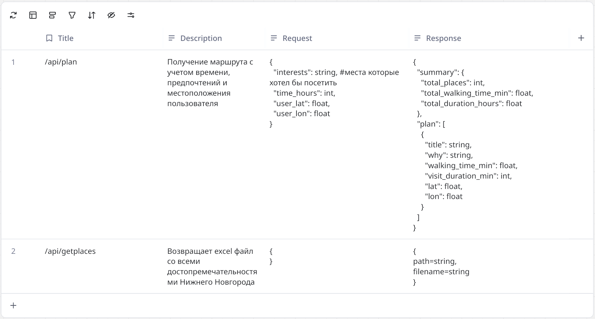

# May помощник туриста

ML-помощник по поиску маршрута в Нижнем Новгороде, наша программа помогает туристам искать маршруты по их предпочтениям и по наличию у них времени.


## Конечные точки



## Запуск

### Требования
- [Git](https://git-scm.com/)
- [Docker](https://www.docker.com/) и [Docker Compose](https://docs.docker.com/compose/)

### Клонирование репо и запуск

1. Клонируйте репозиторий:
   ```bash
   git clone https://github.com/A1exandr2/hack-project.git
   cd hack-project
   ```

2. Запустите приложение в режиме разработки:
   ```bash
   docker compose up --build
   ```

3. Откройте в браузере:
   - **Frontend**: [http://localhost:8080](http://localhost:8080)
   - **Backend API (Swagger-документация)**: [http://localhost:8000/docs](http://localhost:8000/docs)

> При первом запуске сборка может занять 1–3 минуты.

## Остановка контейнеров

Выполните:
```bash
docker compose down
```

## Структура проекта

- `assets/` — материалы markdown
- `backend/` — FastAPI-сервер с маршрутами, геокодированием, созданием описания с использованем GigaChat и интеграцией с картографическими API.
- `frontend/` — React-приложение на Vite с настройками доступности и интерфейсом планирования маршрутов.
- `docker-compose.yml` — оркестрация контейнеров.
- `.env.example` — шаблон переменных окружения (при необходимости скопируйте в `.env`).

## Особенности

- Поддержка тем: стандартная, контрастная, тёмная.
- Все маршруты рассчитываются с учётом пешего передвижения и временных ограничений.
- Интеграция с OpenStreetMap Nominatim (для геокодирования) и OpenRouteService (для посторения маршрутов) + GigaChat (для генерации описаний).
- Использование эмбендингов для поиска лучших совпадений объектов по интересам.

---


> Проект создан в рамках хакатона GorkyCode.